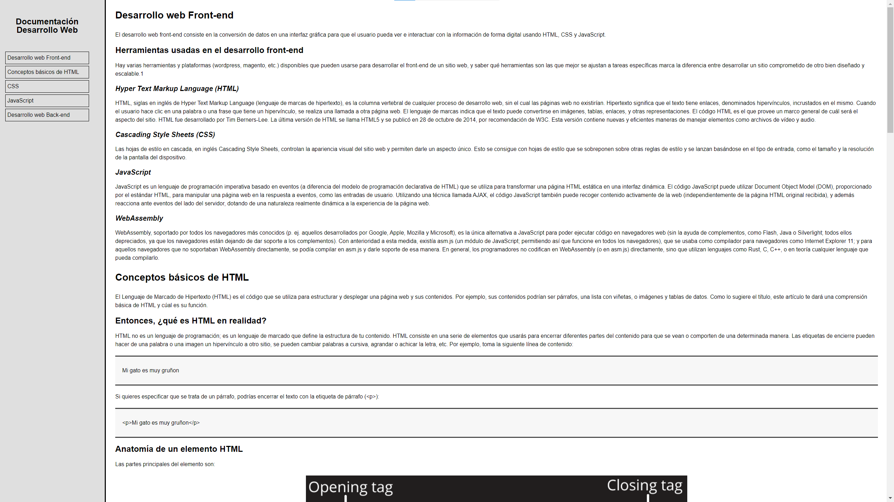
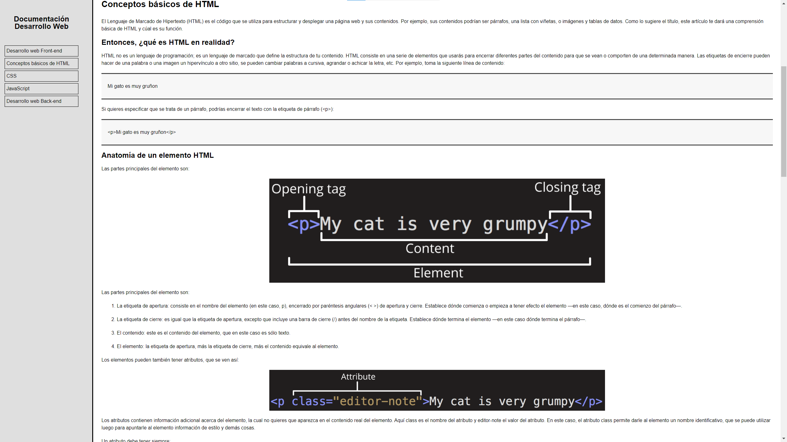
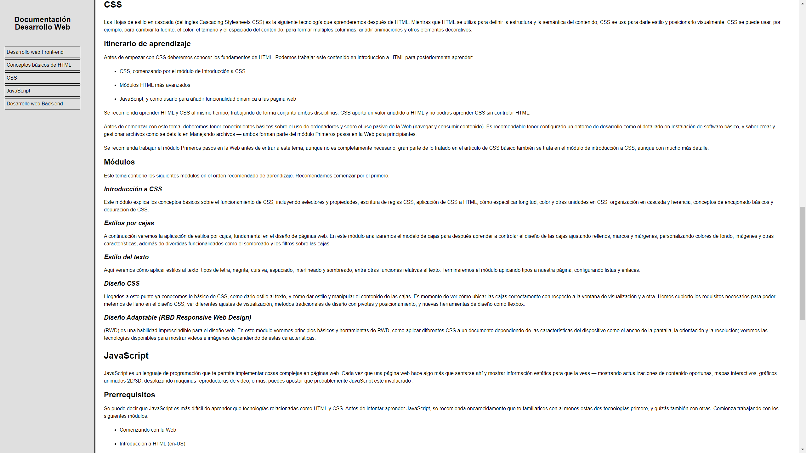
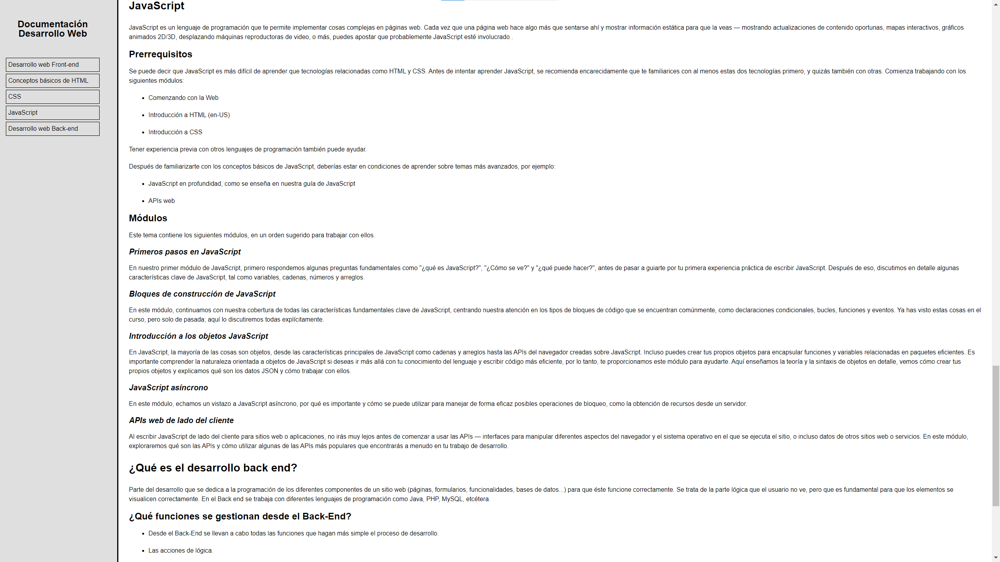
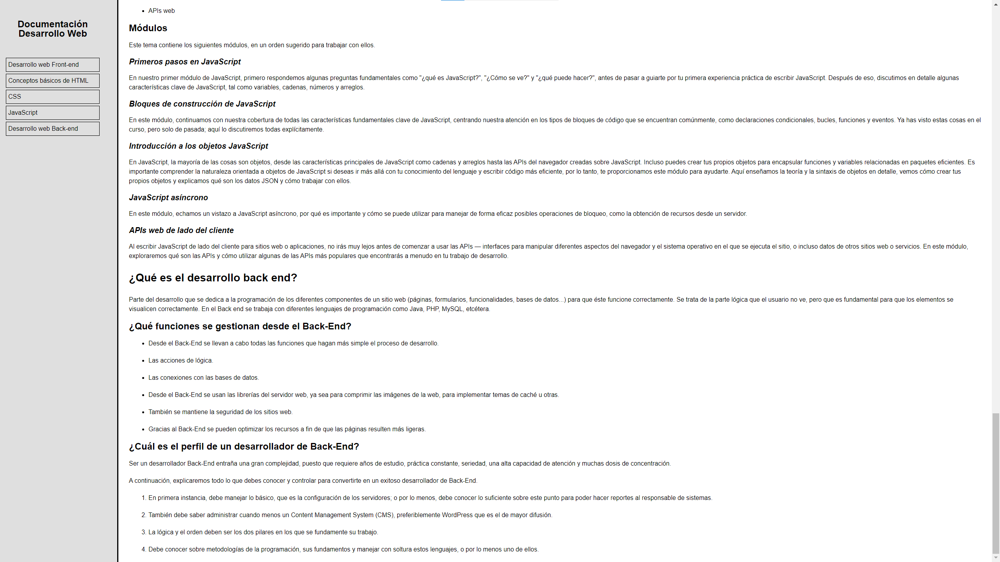

# HTML CSS FAQ

Factoría F5 Project

## Video demonstration

<video src="assets/videos/Screen-Capture.mp4" controls title="Title"></video>

## Screenshots

## Information sources

Front-end: https://es.wikipedia.org/wiki/Desarrollo_web_Front-end  
HTML: https://developer.mozilla.org/es/docs/Learn/Getting_started_with_the_web/HTML_basics  
CSS: https://developer.mozilla.org/es/docs/Learn/CSS  
Javascript: https://developer.mozilla.org/es/docs/Learn/JavaScript  
Back-end: https://www.zorraquino.com/diccionario/internet/que-es-desarrollo-back-end.html  
https://nestrategia.com/desarrollo-web-back-end-front-end/